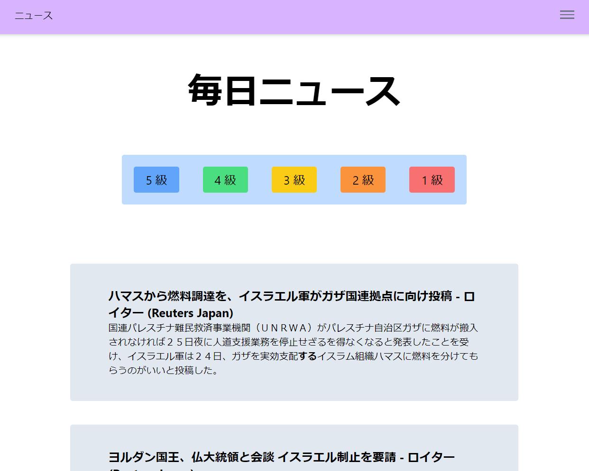

# JLPT News Study App

## General Info
This project serves as an immersive study app for the JLPT. It takes real life news descriptions and higlights the kanji characters based on JLPT (Japanese Language Proficiency Test) level. 
Soon, users will be able to save words they want to study on their account, and make flash cards to study them directly in the app.

## Technologies used
- React
- Typescript
- Next
- Tailwind CSS
- GraphQL

See the backend code: https://github.com/agrimes23/JPNewsBackend
